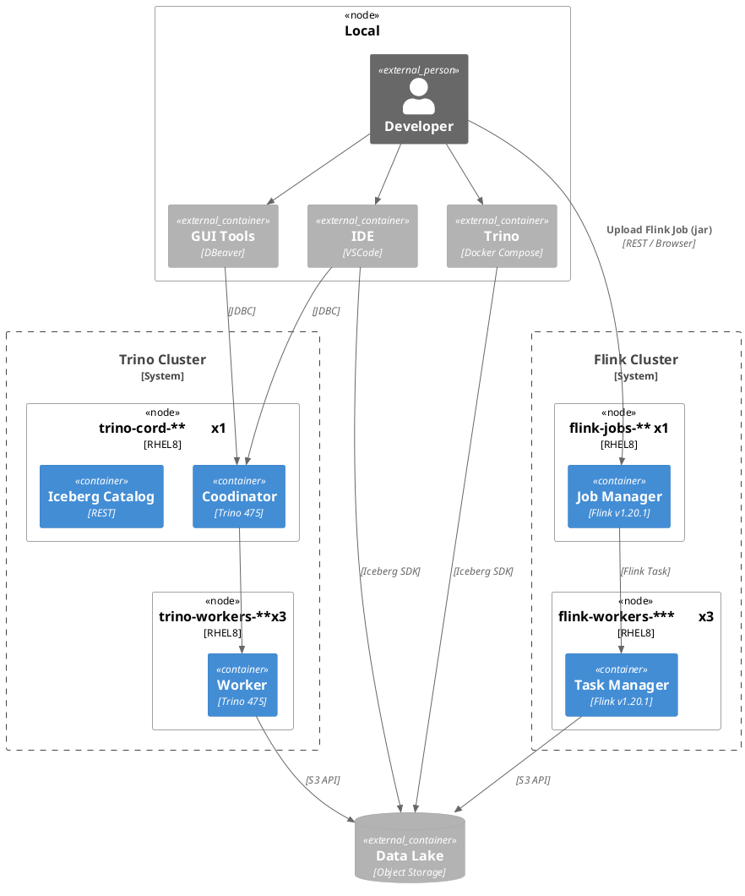

### Trino
* [Deploying Trino](https://trino.io/docs/current/installation/deployment.html)
* AddProperty("Java Version", "23 (Temurin)")
* AddProperty("Java Options", "-Xmx54G (over 32GB, 70~85%)")
* Coordinator
	* AddProperty("http-server.http.port", "8080")
	* AddProperty("discovery.uri", "http://example.net:8080")
	* AddProperty("node.id", "coordinator")
	* AddProperty("node.data-dir", "${WORKSPACE}/data/coordinator")
* Worker
	* AddProperty("Java Version", "23 (Temurin)")
	* AddProperty("Java Options", "-Xmx54G (over 32GB, 70~85%)")
	* AddProperty("http-server.http.port", "8080")
	* AddProperty("discovery.uri", "http://example.net:8080")
	* AddProperty("node.id", "worker**")
	* AddProperty("node.data-dir", "${WORKSPACE}/data/worker")
* H/W Spec
	* `Trino 475 클러스터 HW 사양 추천 (데이터 규모: 10GB 미만/일)`
	* 코디네이터 : 4 Core / 16GB RAM / 100GB SSD
	* 작업자 : 8 Core / 32GB RAM / 200GB SSD (2~3대)
	* 네트워크 1Gbps 이상, SSD 사용 권장
### Flink
* H/W Spec
	* `Flink 1.20 클러스터 HW 사양 추천 (데이터 규모: 10GB 미만/일)`
	* JobManager : 4 Core / 16GB RAM / 100GB SSD
	* TaskManager : 8 Core / 32GB RAM / 200GB SSD (2~3대)

