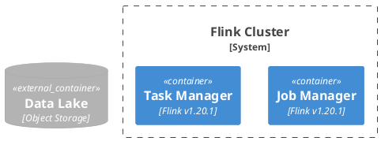

```plantuml
@startuml

!include <C4/C4_Container>
!include <C4/C4_Container>

System_Boundary(flink, "Flink Cluster") {
	Container(flink_job, "Job Manager", "Flink v1.20.1")
	Container(flink_task, "Task Manager", "Flink v1.20.1")
}

ContainerDb_Ext(lake, "Data Lake", "Object Storage")


@enduml
```
