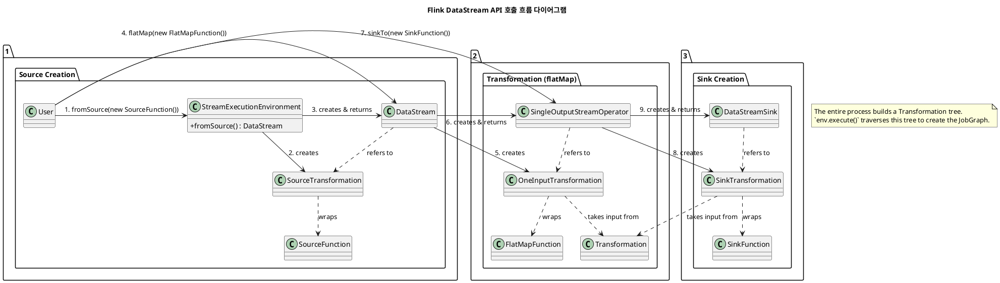
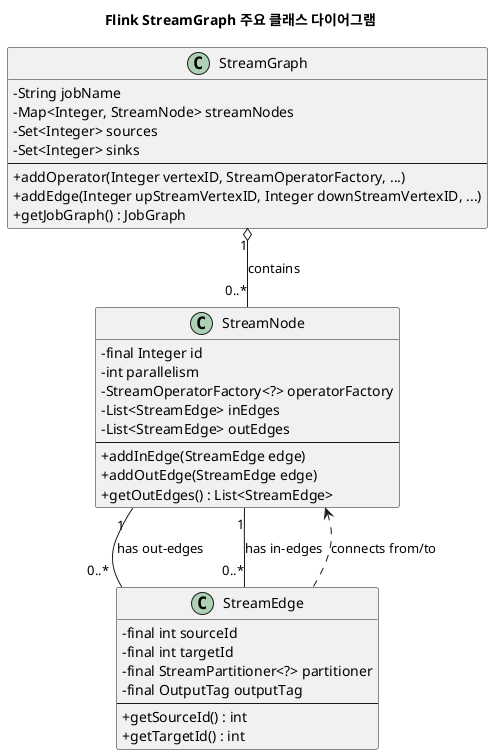
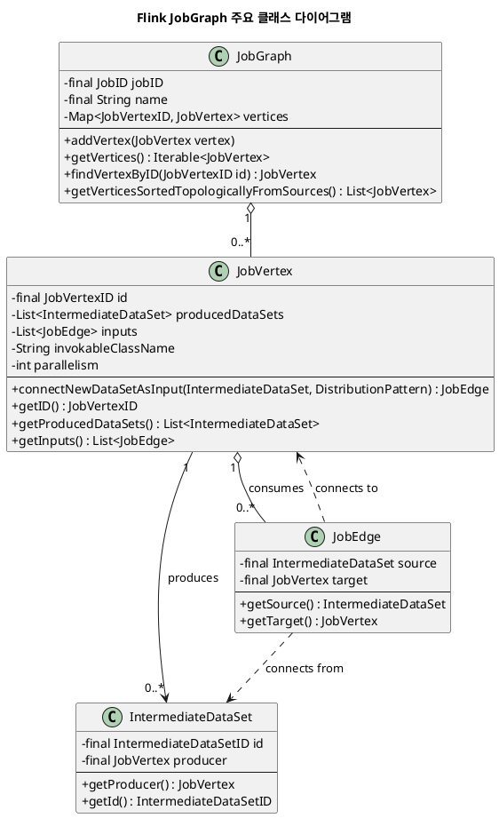
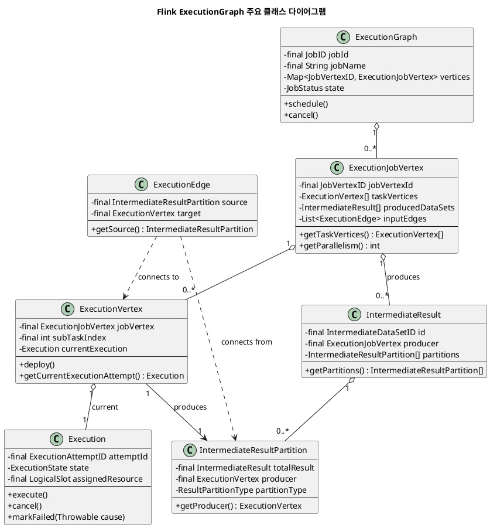

#flink #iceberg

## Architecture

### Flink, Iceberg와 Hadoop 라이브러리 의존성

- **Flink는 기본적으로 Hadoop 없이도 실행 가능**하지만, HDFS 같은 Hadoop 기반 스토리지 접근이나 YARN 리소스 관리 사용 시에는 Hadoop 라이브러리가 필요합니다. Hadoop 라이브러리는 보통 `flink-shaded-hadoop-2-uber` 같은 Uber JAR 형태로 제공되거나 별도 Hadoop 클라이언트 JAR 형태로 포함됩니다.

- **Iceberg Flink Runtime(iceberg-flink-runtime-1.20)** 은 Flink와 Iceberg 통합에 필요한 라이브러리로, Hadoop MapReduce 라이브러리를 필수로 포함하지는 않습니다. 하지만 Iceberg가 내부적으로 Parquet 파일을 처리할 때 Hadoop MapReduce 기반 API(`FileInputFormat` 등)를 사용하므로, Hadoop 관련 라이브러리는 환경에 따라 반드시 포함되어야 합니다.

- Iceberg에서 S3와 같은 오브젝트 스토리지의 Parquet 파일을 읽을 때도 Hadoop 파일 시스템 API와 MapReduce의 입출력 포맷에 의존하기 때문에, **hadoop-mapreduce-client-core 등 Hadoop 라이브러리를 함께 제공해야 정상 작동**합니다.

---

#### 라이브러리 의존 상황 및 필요한 라이브러리

| 상황                        | 필요한 라이브러리 예시                               | 설명                                   |
| ------------------------- | ------------------------------------------ | ------------------------------------ |
| Flink 독립 실행               | Flink Core 라이브러리                           | Hadoop 없이도 동작 가능                     |
| Hadoop 스토리지 접근 (HDFS, S3) | flink-shaded-hadoop-2-uber 또는 하둡 클라이언트 JAR | 파일 시스템 연동 및 Parquet 처리 지원            |
| Iceberg- Flink 통합 사용      | iceberg-flink-runtime, iceberg-aws-bundle  | Iceberg와 Flink 연동, S3 및 Glue 카탈로그 지원 |
| Parquet 파일 입출력            | hadoop-mapreduce-client-core               | Parquet 파일 읽기 위한 MapReduce API       |

- S3 사용 시 `iceberg-aws-bundle`이 AWS 인증 및 S3 접속 기능을 제공합니다.
- Hadoop 관련 JAR들이 Flink 컨테이너 내에 없으면 파일 및 Parquet 작업 중 클래스 오류가 발생할 수 있습니다.

---

#### Flink Docker 이미지에서 Hadoop 의존성 설정 방법

1. **플러그인 디렉토리 설정**  
   - `FLINK_PLUGINS_DIR` 환경변수에 플러그인 JAR들이 위치한 경로 지정(예: `/opt/flink/plugins`)  
   - Docker Compose 또는 `docker run` 시 호스트의 플러그인 디렉토리를 컨테이너에 마운트합니다.

2. **Hadoop 라이브러리 포함**  
   - Flink 기본 Docker 이미지에는 Hadoop 클라이언트 라이브러리가 없음  
   - `flink-shaded-hadoop-2-uber.jar` 또는 필수 하둡 클라이언트 JAR들을 직접 플러그인 디렉토리에 추가  
   - 또는 Hadoop이 포함된 커스텀 Docker 이미지 사용 가능

3. **환경변수로 플러그인 활성화 제어**  
   - `ENABLE_BUILT_IN_PLUGINS=true` (기본값)로 내장 플러그인을 활성화  
   - Hadoop/S3 관련 플러그인 JAR 별도 추가 후 플러그인 폴더에 위치시키기  

4. **AWS S3 연동 시 필요한 설정**  
   - 컨테이너에 `AWS_ACCESS_KEY_ID`, `AWS_SECRET_ACCESS_KEY`, `AWS_REGION` 환경변수 지정  
   - Iceberg 설정 파일에 S3 관련 옵션 및 endpoint 설정  

#### Iceberg Hadoop 의존성 추가 (in Flink Docker Container)

* [Elephant Below the Waterline: Hadoop Dependencies in Iceberg](https://exceptionfactory.com/posts/2024/11/08/elephant-below-the-waterline-hadoop-dependencies-in-iceberg/)
* [examples / catalogs / flink-iceberg-hive / flink / Dockerfile](https://github.com/decodableco/examples/blob/main/catalogs/flink-iceberg-hive/flink/Dockerfile)

```bash
mkdir -p ./lib/hadoop && \
    curl https://repo1.maven.org/maven2/org/apache/commons/commons-configuration2/2.1.1/commons-configuration2-2.1.1.jar -o ./lib/hadoop/commons-configuration2-2.1.1.jar && \
    curl https://repo1.maven.org/maven2/commons-logging/commons-logging/1.1.3/commons-logging-1.1.3.jar -o ./lib/hadoop/commons-logging-1.1.3.jar && \
    curl https://repo1.maven.org/maven2/org/apache/hadoop/hadoop-auth/3.3.4/hadoop-auth-3.3.4.jar -o ./lib/hadoop/hadoop-auth-3.3.4.jar && \
    curl https://repo1.maven.org/maven2/org/apache/hadoop/hadoop-common/3.3.4/hadoop-common-3.3.4.jar -o ./lib/hadoop/hadoop-common-3.3.4.jar && \
    curl https://repo1.maven.org/maven2/org/apache/hadoop/thirdparty/hadoop-shaded-guava/1.1.1/hadoop-shaded-guava-1.1.1.jar -o ./lib/hadoop/hadoop-shaded-guava-1.1.1.jar && \
    curl https://repo1.maven.org/maven2/org/codehaus/woodstox/stax2-api/4.2.1/stax2-api-4.2.1.jar -o ./lib/hadoop/stax2-api-4.2.1.jar && \
    curl https://repo1.maven.org/maven2/com/fasterxml/woodstox/woodstox-core/5.3.0/woodstox-core-5.3.0.jar -o ./lib/hadoop/woodstox-core-5.3.0.jar && \
    curl https://repo1.maven.org/maven2/org/apache/hadoop/hadoop-hdfs-client/3.3.4/hadoop-hdfs-client-3.3.4.jar -o ./lib/hadoop/hadoop-hdfs-client-3.3.4.jar && \
    curl https://repo1.maven.org/maven2/org/apache/hadoop/hadoop-mapreduce-client-core/3.3.4/hadoop-mapreduce-client-core-3.3.4.jar -o ./lib/hadoop/hadoop-mapreduce-client-core-3.3.4.jar
```

---

### Flink ClassLoader 분리

#### ClassLoader 개념 정리

- `Class.forName()`에 명시적으로 ClassLoader를 지정하면, 해당 클래스를 참조하는 다른 클래스도 **지정된 ClassLoader에서 연쇄적으로 로딩**됩니다.  
- `.class` 파일 내의 `import` 구문은 컴파일 시점의 편의를 위한 문법이며, 런타임 클래스 로딩에는 직접 관여하지 않습니다.  
- Java ClassLoader는 부모 위임 모델(Delegation Model)로 동작하여, 클래스 로딩 요청 시 부모 ClassLoader부터 탐색한 후 없으면 자신이 로드합니다.

#### Flink ClassLoader 분리 전략 및 핵심 ClassLoader 설명

- Flink는 사용자 Job 실행 시점에 `FlinkUserCodeClassLoader`라는 별도의 ClassLoader를 생성해, 사용자 제출 JAR과 의존성을 격리 로딩합니다.
- `FlinkUserCodeClassLoader`는 각 TaskManager가 사용자 코드를 실행할 때 쓰이고,  
- `PluginClassLoader`는 플러그인 디렉토리 내의 JAR들을 분리해 안정적인 플러그인 운용이 가능하도록 합니다.
- 이렇게 함으로써 사용자 코드와 Flink 시스템 라이브러리 간 의존성 충돌을 방지합니다.

| ClassLoader                | 역할 및 특징                                                              |
| -------------------------- | -------------------------------------------------------------------- |
| `FlinkUserCodeClassLoader` | 사용자 Job 코드와 라이브러리 전용 ClassLoader, Job 실행 시 로딩                        |
| `PluginClassLoader`        | Flink 플러그인(JAR) 전용 ClassLoader, Hadoop, S3, Iceberg 등 외부 라이브러리 격리 로드 |

#### Flink 플러그인 ClassLoader 동작

- 플러그인은 통상 `FLINK_PLUGINS_DIR` 환경변수로 지정된 경로에 위치하며,  
- Flink는 플러그인 폴더 내 JAR들을 `PluginClassLoader`를 통해 독립된 네임스페이스에서 로드합니다.  
- 이 구조는 플러그인 간 및 Flink 시스템과의 클래스 충돌 방지를 위한 분리 방식을 제공합니다.  
- Hadoop, AWS S3, Iceberg 플러그인 등이 이 ClassLoader 메커니즘을 통해 격리

#### flink-s3-aws-hadoop 플러그인과 Iceberg `S3FileIO` 관계 및 호출 구조

- Flink의 `flink-s3-aws-hadoop` 플러그인은 Flink 환경에서 Hadoop 기반 S3 파일시스템을 구현 및 제공합니다.
- Iceberg는 자체 `S3FileIO` 구현체(`org.apache.iceberg.aws.s3.S3FileIO`)를 사용해 독립적으로 S3에 데이터를 읽고 씁니다.
- 두 컴포넌트는 직접 호출 관계가 없으며, 역할이 분리되어 있습니다.
- Flink 플러그인은 S3 접속 환경과 라이브러리를 제공하며, Iceberg는 데이터 입출력 구현체로서 자체 API를 통해 S3 I/O를 처리합니다.
- 따라서, 플러그인 활성화가 Iceberg 내부 S3 파일 입출력 구현을 대체하지 않으며, 상호 보완적으로 작동합니다.

### Class Diagram

#### Transformation

* flink-core.jar/..api.dag/Transformation
	* flink-streaming-java.jar/..api.transformations/PhysicalTransformation
	* flink-streaming-java.jar/..api.transformations/SourceTransformation
	* flink-streaming-java.jar/..api.transformations/SinkTransformation
	* flink-streaming-java.jar/..api.transformations/OneInputTransformation
		* flink-streaming-java.jar/..api.datastream/DataStream
		* flink-streaming-java.jar/..api.datastream/DataStreamSource
		* flink-streaming-java.jar/..api.datastream/SingleOutputStreamOperator
			* flink-core.jar/..api.connector.source/Source
				* flink-streaming-java.jar/..api.environment/StreamExecutionEnvironment
					* ::fromSource(..), ::fromData(..)



#### StreamGraph


#### JobGraph



#### ExecutionGraph



## Deploy

### Flink Docker Compose

#### Usage

* Flink JobManager UI - http://localhost:8081

```bash
docker compose up -d
```

```bash
docker ps
```

#### Docker Compose File

```yaml
services:
  jobmanager:
    image: apache/flink:1.20.2
    environment:
      - JOB_MANAGER_RPC_ADDRESS=jobmanager
      - FLINK_PLUGINS_DIR=/opt/flink/plugins
    ports:
      - "8081:8081"
    volumes:
      - ./plugins:/opt/flink/plugins
      - ./conf/flink-conf.yaml:/opt/flink/conf/flink-conf.yaml:ro
    command: jobmanager

  taskmanager:
    image: apache/flink:1.20.2
    profiles:
      - task
    environment:
      - JOB_MANAGER_RPC_ADDRESS=jobmanager
      - FLINK_PLUGINS_DIR=/opt/flink/plugins
    depends_on:
      - jobmanager
    volumes:
      - ./plugins:/opt/flink/plugins
      - ./conf/flink-conf.yaml:/opt/flink/conf/flink-conf.yaml:ro
    command: taskmanager
    deploy:
      replicas: 1
```

#### Flink Config File

```yaml
# Path : conf/flink-conf.yaml
# Iceberg REST Catalog 설정 예시
iceberg.catalog-type: rest
iceberg.catalog-impl: org.apache.iceberg.rest.RESTCatalog
iceberg.uri: http://localhost:8181
iceberg.warehouse: s3://your-bucket/warehouse

# AWS S3 인증 및 endpoint (필요 시)
s3.access-key: YOUR_ACCESS_KEY
s3.secret-key: YOUR_SECRET_KEY
s3.endpoint: https://maxio.com
s3.path-style-access: true
```

#### References

- [Building a Local Flink Environment with Docker and Submitting Your First Job (tim santeford)](https://www.timsanteford.com/posts/building-a-local-flink-environment-with-docker-and-submitting-your-first-job/)  
- [Apache Flink SQL Client on Docker (DEV Community)](https://dev.to/ftisiot/apache-flink-on-docker-4kij)  
- [Setup Local Development Environment for Apache Flink and Spark Using EMR Container Images (Jaehyeon Kim)](https://jaehyeon.me/blog/2023-12-07-flink-spark-local-dev/)  

### Iceberg Config


## SQL Gateway

### Flink SQL Gateway 주요 호출 흐름 (select * from test 기준)

1. **SqlGatewayServiceImpl.executeStatement(String sessionId, String statement, ...)**  
   - 클라이언트가 SQL 요청을 보낼 때 호출되는 진입점 메서드  
   - `statement`에 `"select * from test"`가 전달됨  
   - 새로운 `Operation` (대부분 `QueryOperation`) 객체를 생성하여 쿼리 실행 준비  
   - 생성된 Operation ID를 반환하거나 Operation 상태를 관리하는 Future를 생성  

2. **QueryOperation.execute()**  
   - 실제 쿼리 실행 시작 메서드  
   - SQL 파싱(Parsing) → 분석(Analysis) → 실행 계획 생성  
   - Flink 테이블 API 또는 SQL 엔진을 호출하여 물리 실행 플랜 구축  
   - 결과 DataStream 또는 Table 결과 확보  
   - 비동기 처리로 실행 상태 `RUNNING`으로 변경  

3. **SqlGatewayServiceImpl.getOperationStatus(operationId)**  
   - 클라이언트가 쿼리 상태를 요청할 때 호출  
   - Operation 상태 조회 (예: RUNNING, FINISHED, ERROR) 반환  
   - 실행 중인 쿼리 진행 상황을 확인하는 용도  

4. **SqlGatewayServiceImpl.fetchResults(operationId, fetchOrientation, maxRows)**  
   - 쿼리 결과를 페이징 방식으로 가져올 때 호출됨  
   - 내부적으로 `ResultFetcher.fetchNext()` 메서드를 사용해 다음 결과 배치를 리턴  
   - `fetchOrientation`은 NEXT, FIRST 등 페이징 동작 지정  
   - `maxRows`만큼 결과를 잘라서 클라이언트에 반환  

5. **ResultFetcher.fetchNext()**  
   - 실행된 쿼리 결과셋을 스냅샷하거나 Stream으로부터 페이징 단위 데이터 추출  
   - 내부 버퍼 또는 상태 저장소에서 데이터를 읽어옴  
   - 클라이언트가 다음 페이지를 요청할 때마다 호출되어 데이터 반환을 계속 진행  

6. **Operation.close()**  
   - 클라이언트가 쿼리 종료를 요구하거나 시간이 만료될 때 호출  
   - 실행 리소스 해제, 세션 종료 처리  
   - 내부에서 TableEnvironment, Job 등 관련 리소스를 정리  

요약:

| 호출 위치                      | 주요 메서드                 | 설명                       |
| -------------------------- | ---------------------- | ------------------------ |
| SQL Gateway Service        | `executeStatement()`   | Operation 생성 및 SQL 실행 시작 |
| Operation (QueryOperation) | `execute()`            | 실제 SQL 파싱 및 실행 실행        |
| SQL Gateway Service        | `getOperationStatus()` | 실행 상태 조회                 |
| SQL Gateway Service        | `fetchResults()`       | ResultFetcher로 결과 페이징 조회 |
| ResultFetcher              | `fetchNext()`          | 다음 페이지 결과 데이터 반환         |
| Operation                  | `close()`              | 리소스 해제 및 종료 처리           |

### Iceberg Flink Runtime Config

```yaml
jobmanager:
  # Cannot instantiate the coordinator for operator Source: test_table[] -> Sink: Collect table sink
  - iceberg-flink-runtime-1.20-1.9.2.jar
  - iceberg-aws-bundle-1.9.2.jar  # software.amazon.awssdk.core.exception.SdkException
  - flink-s3-fs-hadoop-1.20.1.jar # org.apache.hadoop.conf.Configurable

taskmanager:
  # Source: test_table[] -> Sink: Collect table sink : Cannot instantiate user function
  - iceberg-flink-runtime-1.20-1.9.2.jar
  - flink-s3-fs-hadoop-1.20.1.jar # org.apache.hadoop.conf.Configurable
  - iceberg-aws-bundle-1.9.2.jar  # No FileSystem for scheme "s3"
  - hadoop-mapreduce-client-core-3.3.1.jar. # org.apache.hadoop.mapreduce.lib.input.FileInputFormat

sql-gateway:
  # Could not find any factory for identifier 'iceberg' that implements 'org.apache.flink.table.factories.CatalogFactory' in the classpath.
  - iceberg-flink-runtime-1.20-1.9.2.jar
  - flink-s3-fs-hadoop-1.20.1.jar # org.apache.hadoop.conf.Configuration, com.ctx.wstx.io.InputBootstrapper
  - hadoop-hdfs-client-3.3.1.jar  # org.apache.hadoop.hdfs.HdfsConfiguration
  - iceberg-aws-bundle-1.9.2.jar  # software.amazon.awssdk.core.exception.SdkException
  # - hadoop-mapreduce-client-core-3.3.1.jar. # org.apache.hadoop.mapreduce.lib.input.FileInputFormat
```

```bash
# https://github.com/apache/flink-docker/master/1.20/scala_2.12-jara11-ubuntu/Dockerfile
FROM flink:1.20.2

COPY lib/iceberg-*.jar /opt/flink/lib
COPY lib/hadoop/*.jar  /opt/flink/lib

ENTRYPOINT ["/docker-entrypoint.sh"]
EXPOSE 6123 8081
CMD ["help"]
```