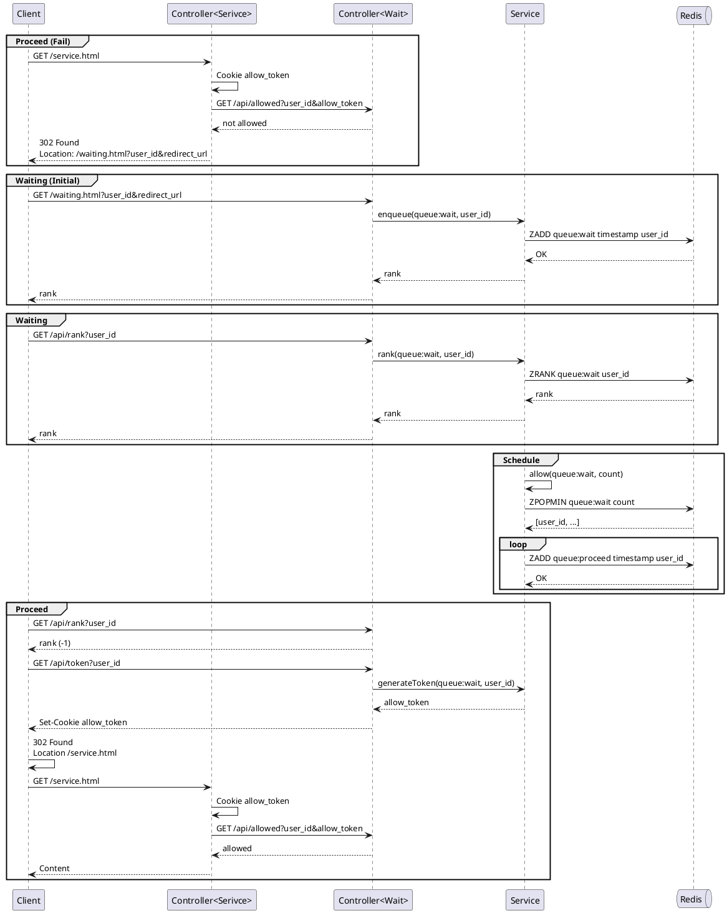

#redis #system-design

### First-come, first-served

* [UserQueueService.java](https://github.com/morenice/fastcampus-2023-backend-advacned/blob/main/ch4/clip08/flow/src/main/java/com/fastcampus/flow/service/UserQueueService.java)

#### Sequence Diagram

##### Version 1

