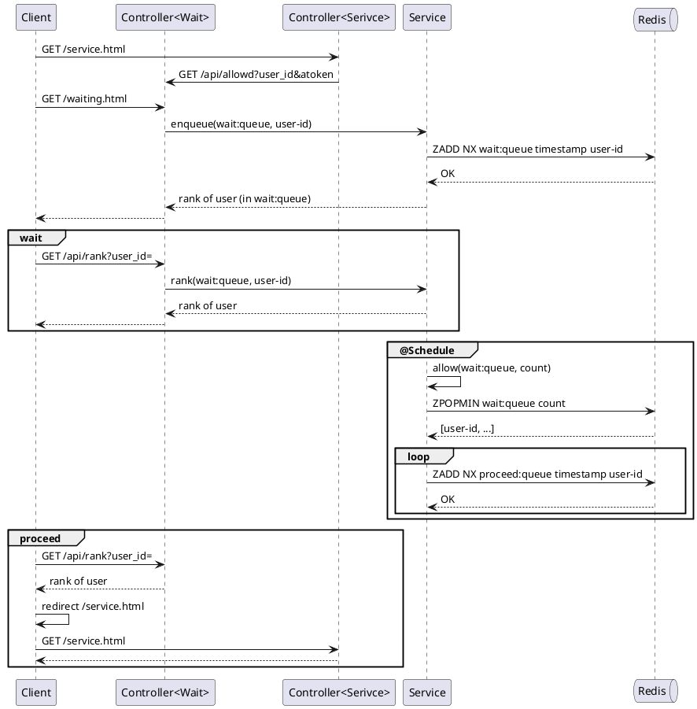

#redis #system-design

### First-come, first-served

* [UserQueueService.java](https://github.com/morenice/fastcampus-2023-backend-advacned/blob/main/ch4/clip08/flow/src/main/java/com/fastcampus/flow/service/UserQueueService.java)



```
Controller -> Service: generateToken(wait:queue, user-id)
Controller <-- Service: allow-token
Client <-- Controller: rank of user + Cookie(allow-token)
```
