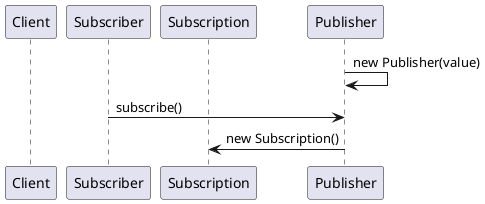

#reactive-streams #reactive

```plantuml
@startuml

participant Client as Client
participant Subscriber as Subr
participant Subscription as Sub
participant Publisher as Pub

Pub -> Pub: new Publisher(value)
Subr -> Pub: subscribe()
Pub -> Sub: new Subscription()

@enduml
```
