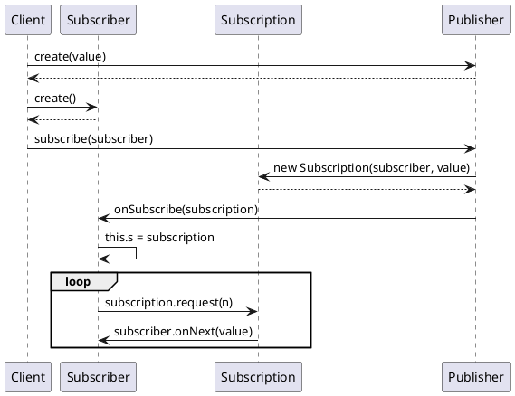

#reactive-streams #reactive

```plantuml
@startuml

participant Client as Client
participant Subscriber as Sub
participant Subscription as Subn
participant Publisher as Pub

Client -> Pub: create(value)
Client <-- Pub
Client -> Sub: create()
Client <-- Sub

Client -> Pub: subscribe(subscriber)
Pub -> Subn: new Subscription(subscriber, value)
Pub <-- Subn
Pub -> Sub: onSubscribe(subscription)

Sub -> Sub: this.s = subscription
group loop
  Sub -> Subn: subscription.request(n)
  Subn -> Sub: subscriber.onNext(value)
end


@enduml
```
