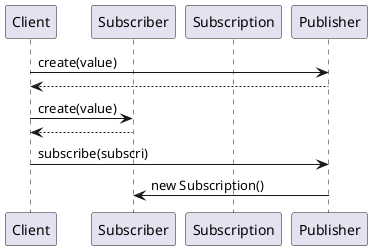

#reactive-streams #reactive

```plantuml
@startuml

participant Client as Client
participant Subscriber as Sub
participant Subscription as Subn
participant Publisher as Pub

Client -> Pub: create(value)
Client <-- Pub
Client -> Sub: create(value)
Client <-- Sub

Client -> Pub: subscribe(subscri)
Pub -> Sub: new Subscription()

@enduml
```
