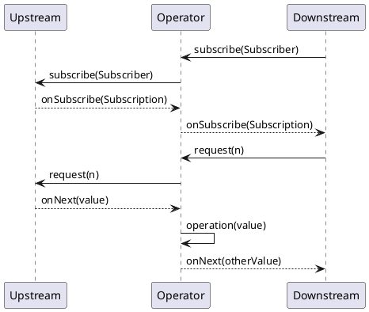

#reactive-streams #reactive

* https://www.linkedin.com/pulse/reactive-streams-specification-java-aliaksandr-liakh
* https://meetup.nhncloud.com/posts/374
* https://github.com/reactor/reactor-core/blob/main/reactor-core/src/main/java/reactor/core/publisher/MonoMap.java

