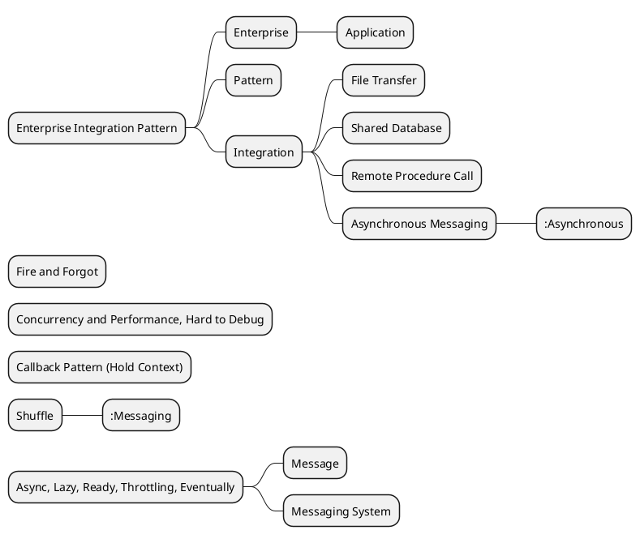

```plantuml
@startmindmap
+ Enterprise Integration Pattern

++ Enterprise
+++ Application

++ Pattern

++ Integration
+++ File Transfer
+++ Shared Database
+++ Remote Procedure Call
*** Asynchronous Messaging
**** :Asynchronous
- Fire and Forgot
- Concurrency and Performance, Hard to Debug
- Callback Pattern (Hold Context)
- Shuffle

**** :Messaging
- Async, Lazy, Ready, Throttling, Eventually

**** Message
**** Messaging System
@endmindmap
```
