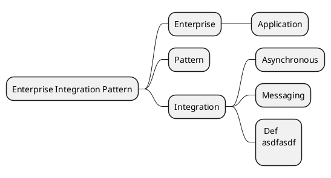
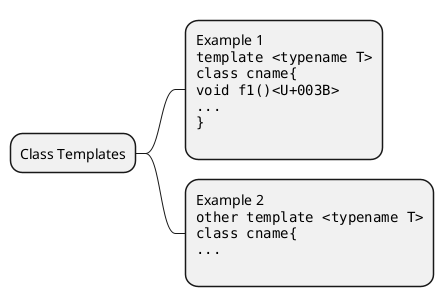

```plantuml
@startmindmap
+ Enterprise Integration Pattern

++ Enterprise
+++ Application

++ Pattern

++ Integration
+++ Asynchronous
+++ Messaging
***: Def
asdfasdf
;
@endmindmap
```

```plantuml
@startmindmap
* Class Templates
**:Example 1
<code>
template <typename T>
class cname{
void f1()<U+003B>
...
}
</code>
;
**:Example 2
<code>
other template <typename T>
class cname{
...
</code>
;
@endmindmap
```
